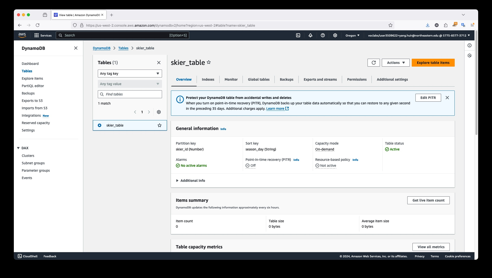
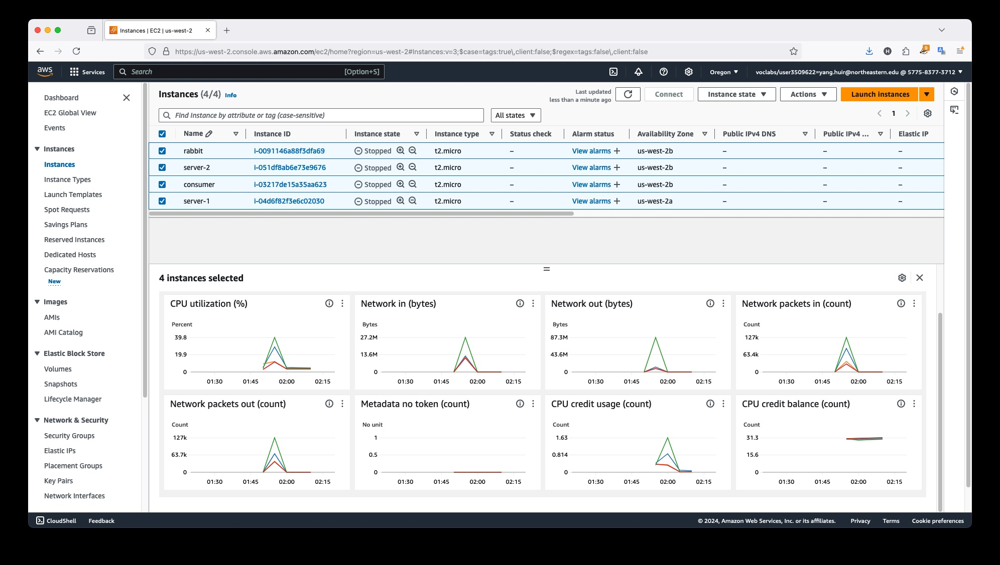
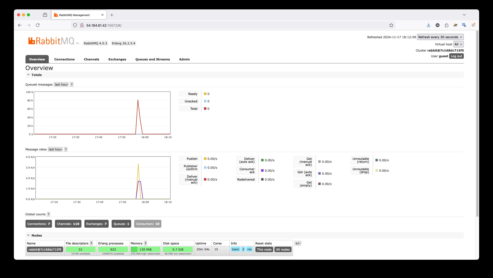
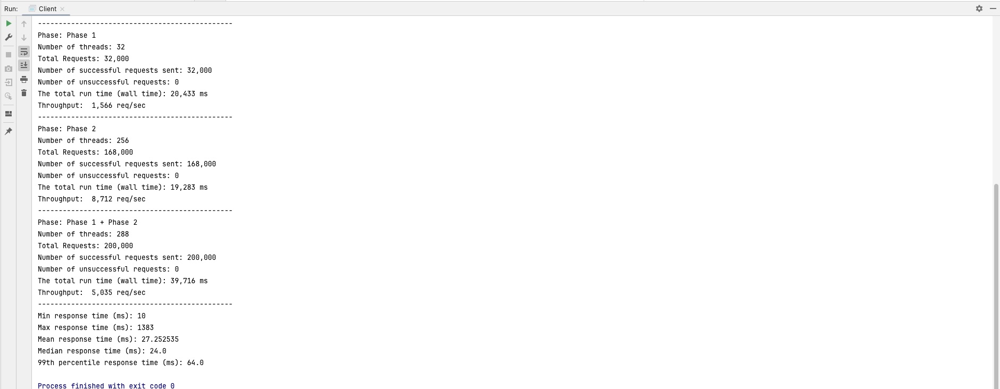
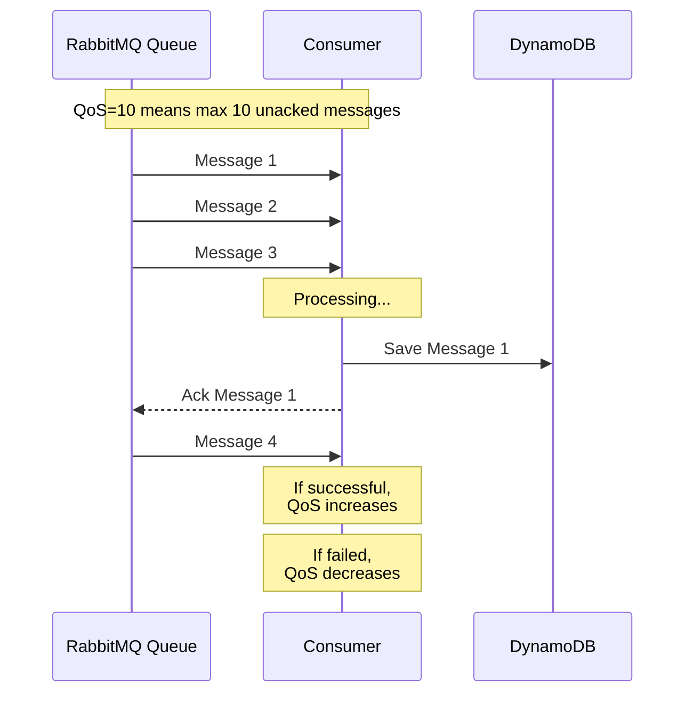
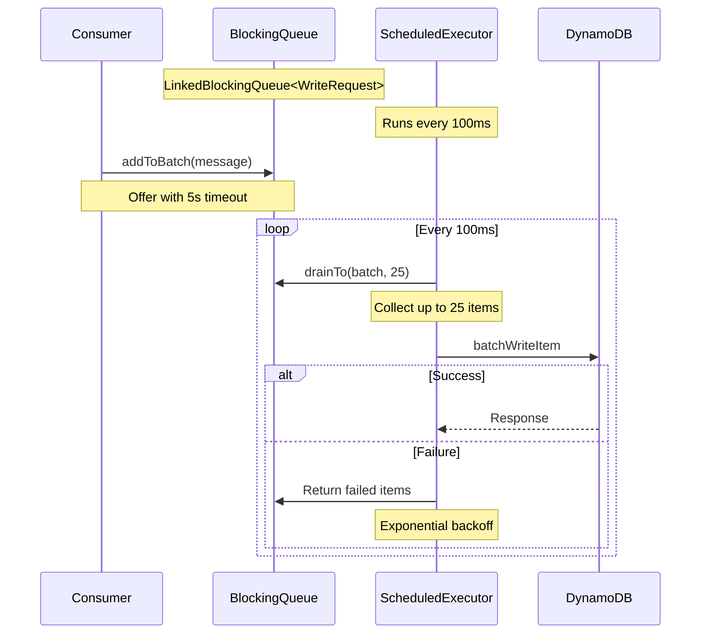
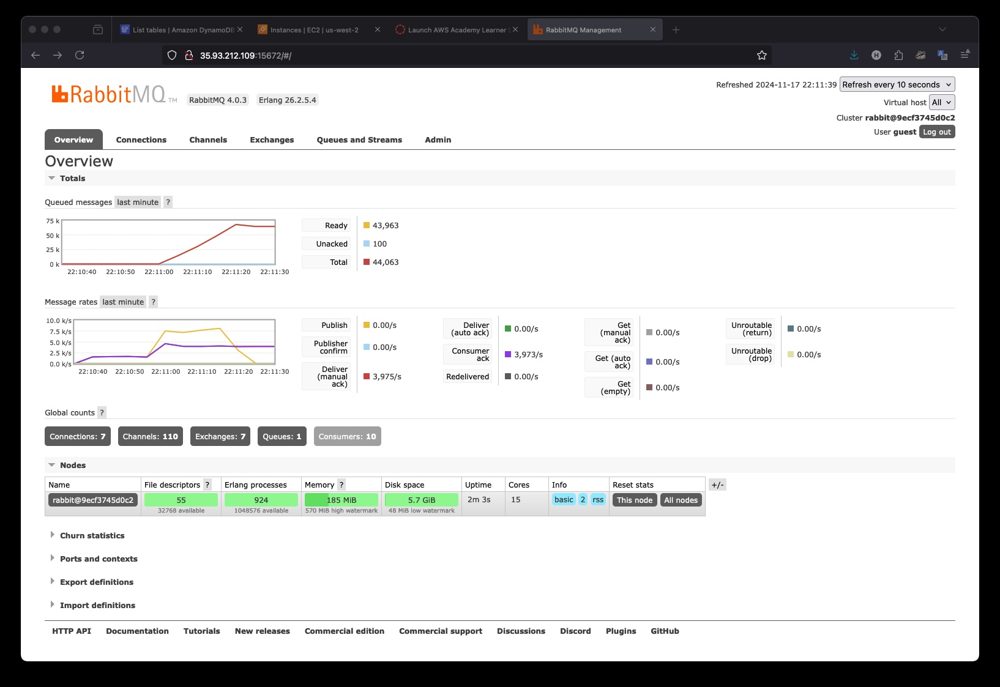
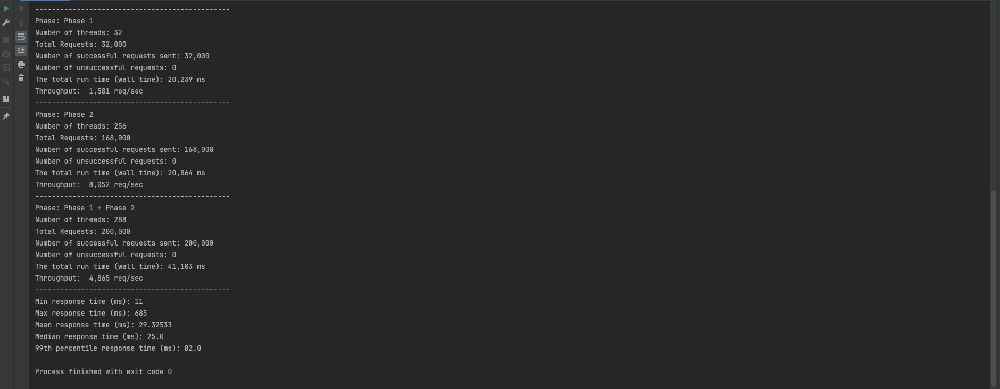

# GitHub Repo Link
https://github.com/cptbtptp01/distributed-skier-api-system/tree/main/server
# Database
## Data Model
The following data fields are required for the system:
- Skier ID: Integer
- Resort ID: Integer
- Season ID: String
- Day ID: String
- Lift ID: Integer
- Lift Time: Integer

## Determine Pattern from Queries
|   | Query                                                          | Access                             |
|---|----------------------------------------------------------------|------------------------------------|
| 1 | For a skier #N, how many days skied this season?               | Skier -> Season -> Day             |
| 2 | For a skier #N, what are the vertical totals for each ski day? | Skier -> Season -> Day -> Vertical |
| 3 | For a skier #N, show lifts ridden on each ski day              | Skier -> Season -> Day -> Lift     |
| 4 | How many unique skiers visited resort X on day N?              | Resort -> Day -> Skiers            |

## DynamoDB
DynamoDB is selected for this use case due to its ability to handle high concurrency, particularly with write-heavy workloads (e.g., 200,000 concurrent requests). The key advantages are:

- Simple Key-Value Model: DynamoDB efficiently handles simple key-value data storage, which aligns with the data access patterns.
- Scalability: DynamoDB automatically partitions data and distributes the workload, allowing it to manage large numbers of concurrent writes without performance degradation.

## Table Design

### Determine keys

| Partition Key (PK) | Sort Key (SK) | Attribute 1 | Attribute 2 | Attribute 3 | Attribute 4 |
|--------------------|---------------|-------------|-------------|-------------|-------------|
| Skier ID           | Season#Day    | Resort ID   | Lift ID     | Lift Time   | Vertical    |

- Primary Key:
  - Partition Key (PK): The Skier ID is used as the partition key to group all data for a specific skier together.
  - Sort Key (SK): A combination of Season and Day (formatted as Season#Day) is used as the sort key, to optimize queries require season and day-based data retrieval (e.g. query 1-3).
- Global Secondary Index (GSI): To support queries that do not primarily rely on Skier ID, a Global Secondary Index can be added, for example, for query 4 we specify as follows:
  - Partition Key: Resort ID
  - Sort Key: Season#Day

## Table Configuration


# Testing
## Client configuration:
- Phase1 thread: 32
- Phase2 thread: 256
- Phase1 requests: 32,000
- Phase2 requests: 168,000
## Deployment Topologies

- Two Servers: Incoming traffic was distributed using a load balancer
- One RabbitMQ: Served as the message broker for publishing and consuming messages, acknowledged messages were written to the database
- One Consumer: Responsible for consuming messages from RabbitMQ and writing data into the database
## Testing 1
### RabbitMQ Console

- Queued messages: ~8,000
- Publish Rate: ~3,500k/sec
- Consumer Acknowledgement Rate: ~2,000/sec
### Client Stats

- Phase1: 1,566 req/sec
- Phase2: 8,712 req/sec
- Phase1 + Phase2: 5,035 req/sec
- Mean response time: 24.0 ms
### Observation
- The publishing rate significantly outpaced the consumer’s acknowledgement rate, causing messages to queue up.
- Consumers are unable to keep up with the publishing rate, resulting in a backlog.
## Testing 2
### Consumer Optimization

```java
  // Throttling configuration (Tunable)
  private final RateLimiter rateLimiter;
  private static final int REQUESTS_PER_SECOND = 4000;
  private static final int INITIAL_QOS = 10;
  private static final int MAX_QOS = 50;
  private static final int MIN_QOS = 5;
  private final Map<Channel, Integer> channelQoS = new ConcurrentHashMap<>();
```
- Throttling Mechanisms
  - Add RateLimiter sets the maximum number of messages that can be processed per second across all consumers
  - Dynamic QoS (Quality of Service) Parameters
Together, the interaction between rate limiting and QoS:
```java
DeliverCallback deliverCallback = (consumerTag, delivery) -> {
    try {
        // First, check if we're within our rate limit
        rateLimiter.acquire();
        
        // Then process the message
        boolean processed = processMessage(message);
        
        if (processed) {
            // Success: acknowledge and maybe increase QoS
            channel.basicAck(delivery.getEnvelope().getDeliveryTag(), false);
            increaseQoS(channel);
        } else {
            // Failure: reject and decrease QoS
            channel.basicNack(delivery.getEnvelope().getDeliveryTag(), false, true);
            decreaseQoS(channel);
        }
    } catch (Exception e) {
        // Handle errors
    }
};
```
### DynamoDB Client Optimization

- Throttling Mechanisms
  - Automatic batch processing with fixed interval (with dynamodb's batch limit 25)
  - Add retry mechanism when process batch writes with exponential backoff
### RabbitMQ Console


### Client Stats

- Phase1: 1,581 req/sec
- Phase2: 8,052 req/sec
- Phase1 + Phase2: 4,865 req/sec
- Mean response time: 24.0 ms

### Observation
From the charts and client stats, publish rate and consumer ack rate were close at the early stage (e.g. publish rate at 3,745/s, consumer ack at 4,101/s),however, messages gradually queued up, and consumer gradually couldn't catch publish rate, throughput might need to be controlled from client side (future improvement).